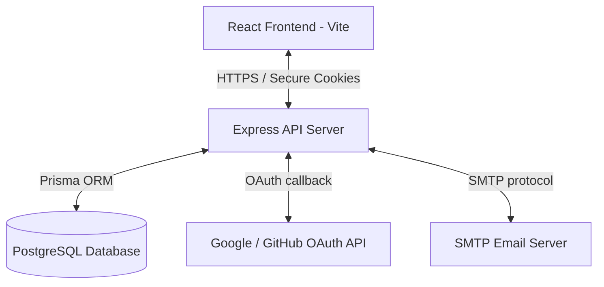
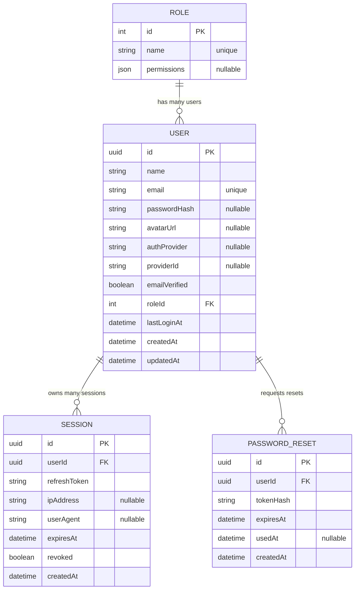
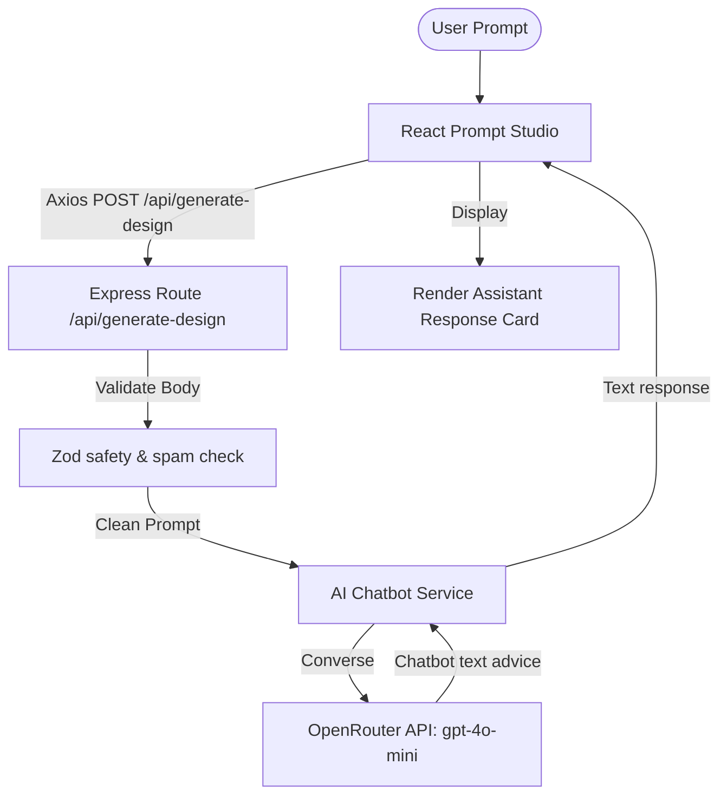

# Technical Project Report: AI Figma UI/UX Design Generator Platform

## Executive Summary
This document provides a comprehensive technical overview of the **AI Figma UI/UX Design Generator Platform**. It explains the architecture, the technology stack chosen, and the reasoning behind each architectural design decision.

The platform is designed to allow product teams, design professionals, and developers to describe their user interfaces in plain language and receive layout files and Figma-ready designs in seconds.

Currently, the codebase includes:
1. **Frontend App**: An interactive, premium React dashboard with Prompt Studio, Projects Management, and Live Canvas Preview capabilities.
2. **Backend Authentication Server (Node.js + PostgreSQL)**: An enterprise-grade, secure, multi-device authentication and authorization subsystem. It integrates Role-Based Access Control (RBAC), token rotation, session auditing, and third-party OAuth provider integrations.

---

## 1. System Architecture Overview

The system uses a decoupled **Client-Server Architecture** to separate user-facing UI/UX design features from data access, business logic, and security configurations.



### Component Details
*   **Client Dashboard (React + Vite)**: A fast, modern Single Page Application (SPA) styled with vanilla CSS using modern glassmorphism aesthetics. It maintains a secure connection with the server via HTTP cookies.
*   **Express API Server**: A modular Node.js server that validates incoming requests, handles business rules (signup/login, session security, OAuth callback parsing), and communicates with the database.
*   **Prisma ORM & PostgreSQL Database**: A relational database layer providing strict constraints and data integrity for roles, users, and multi-device sessions.

---

## 2. Tech Stack Analysis: What We Used and Why

### Frontend Stack

| Technology | Role | Rationale (Why We Used It) |
| :--- | :--- | :--- |
| **React** | Component Framework | Enables modular, reusable UI components. Its declarative nature and state management make handling real-time AI outputs and session status intuitive. |
| **Vite** | Build Tool & Server | Replaces slower bundlers like Webpack. Vite leverages native ES Modules to supply instant hot module reloading (HMR) and fast build processes. |
| **React Router DOM** | SPA Navigation | Provides client-side routing. It secures dashboard pages behind custom navigation guards (`ProtectedRoute`) without page reloads. |
| **Vanilla CSS (Modern Custom Props)** | Layout & Styling | Avoids Tailwind/utility bloat, providing maximum design customization. CSS variables make it easy to maintain consistent colors, gradients, and glassmorphism styling. |

### Backend Stack

| Technology | Role | Rationale (Why We Used It) |
| :--- | :--- | :--- |
| **Node.js + Express** | Web Server Framework | JavaScript-end-to-end execution. Express is lightweight and has a huge ecosystem of middleware for security, cookie parsing, and rate limiting. |
| **Prisma ORM** | Object-Relational Mapper | Auto-generates a type-safe database client. It prevents raw SQL injection vulnerabilities and accelerates database modeling through a schema definition file. |
| **PostgreSQL** | Relational Database | Relational integrity is crucial for handling users, roles, revocable sessions, and design audit histories. Its ACID guarantees prevent data corruption. |
| **Passport.js** | Identity Federation | Standardizes social login integrations (Google and GitHub OAuth2), keeping user signups friction-free and lowering abandonment. |

### Security & Utilities

| Technology | Role | Rationale (Why We Used It) |
| :--- | :--- | :--- |
| **JSON Web Token (JWT)** | Authorization Tokens | Implements a dual-token (Access + Refresh) model for stateless authentication. It minimizes database requests for simple resource reads. |
| **bcryptjs** | Password Hashing | One-way hashing algorithm (`saltRounds = 12`) to secure passwords. It defends against brute force, rainbow tables, and lookup attacks. |
| **Zod** | Input Validation | Validates incoming payloads at the server boundaries. It prevents bad, corrupted, or malicious data from reaching database operations. |
| **express-rate-limit** | Brute-force Prevention | Restricts IP request rates on sensitive endpoints (Login, Signup, Forgot Password) to defend against credential stuffing attacks. |
| **Helmet** | HTTP Header Security | Configures HTTP headers dynamically to protect the app from typical vulnerabilities like Clickjacking and XSS. |
| **Nodemailer** | Transactional Emails | Delivers temporary, cryptographically secure password reset links directly to verified emails. |

---

## 3. Database Layer & Schema Design

The schema is defined in `server/prisma/schema.prisma` using PostgreSQL mapping. It features four main models optimized for security and Role-Based Access Control (RBAC).



### Key Relational Implementations:
1.  **RBAC Role Model**: The `Role` table stores permission definitions as raw JSON (e.g. `{ "generateDesigns": true, "exportDesigns": true }`). This allows granular checks using the `requirePermission("permissionName")` middleware.
2.  **Session Revocation (`onDelete: Cascade`)**: If a User account is deleted, all their active database sessions and password reset logs are automatically deleted via PostgreSQL foreign-key cascade rules, avoiding orphaned data.
3.  **Password Reset Auditing**: Stores the SHA-256 hash of tokens rather than plain text. Once used, the token is marked in `usedAt`, ensuring it cannot be re-used.

---

## 4. Codebase Structure & Software Architecture Patterns

The application is structured logically to separate backend services from frontend views.

### Directory Mapping
```
├── server/                    # Backend API Server
│   ├── prisma/                # Prisma DB Schemas, migrations & seeds
│   │   ├── schema.prisma      # PostgreSQL Database model definitions
│   │   └── seed.js            # Initial Roles setup (Admin, User)
│   ├── src/                   # Server Source Code
│   │   ├── app.js             # Express configurations (CORS, cookies, Helmet)
│   │   ├── server.js          # Main entrypoint, runs on port 4000
│   │   ├── config/            # Application variables and OAuth setups
│   │   ├── middleware/        # Authentication, rate limiting, validator guards
│   │   ├── modules/
│   │   │   └── auth/          # Decoupled Domain: Authentication Module
│   │   │       ├── controllers/    # Express route request handlers
│   │   │       ├── services/       # Core business logic (signup, reset pass)
│   │   │       ├── repositories/   # Direct Prisma database queries
│   │   │       ├── routes/         # Express endpoint maps
│   │   │       └── validators/     # Zod payload schemas
│   │   └── utils/             # Mailers, token hashing helpers
├── src/                       # Frontend SPA (React + Vite)
│   ├── components/            # Layout, Navbars, Route guards
│   ├── context/               # Global states (AuthContext api bindings)
│   ├── lib/                   # API utilities (Fetch base settings)
│   ├── pages/                 # Full pages (Studio, Projects, Reset)
│   └── index.css              # Custom variables, visual layouts
└── package.json               # Package configurations
```

### Backend Domain-Driven Layered Pattern
The auth backend is architected using the **Domain-Driven Layered Pattern**. Instead of cluttering controllers, tasks are separated cleanly:
1.  **Validator**: Validates client input shapes (e.g., `signupSchema`) in the Express layer before reaching execution.
2.  **Controller**: Extracts headers, parameters, client IPs/UserAgents, and triggers the appropriate Service method. Returns the HTTP status code and response payload.
3.  **Service**: Contains calculations, JWT creation, password comparisons, email dispatching, and orchestration.
4.  **Repository**: Deals exclusively with database CRUD operations via Prisma. Keeps database adapters separated from business logic.

---

## 5. Security Protocols & Safeguards In Place

This application prioritizes enterprise security standards:

*   **Double-Token Architecture**:
    *   **Access Token (JWT)**: Has a short lifespan (15 minutes), containing user info, role, and permissions. Read dynamically for rapid API authorization checks.
    *   **Refresh Token (JWT)**: Has a long lifespan (30 days), stored in the database.
    *   When the Access Token expires, the frontend calls the `/refresh` endpoint, which checks the validity of the Refresh Token, revokes the current database session, and issues a new pair. This protects against leaked tokens (Token Rotation).
*   **HttpOnly Cookies**: Access and Refresh tokens are delivered via cookies configured with `httpOnly: true` (impenetrable by frontend JavaScript scripts to neutralize Cross-Site Scripting (XSS)) and `sameSite: "lax"` (mitigating CSRF).
*   **Brute-Force Rate Limiting**: Limit rules configured per-endpoint:
    *   General auth requests: max 20 requests per 15 mins.
    *   Login submissions: max 10 attempts per 15 mins.
    *   Password Resets: max 5 requests per hour.
*   **Hashing Guidelines**: Passwords are encrypted with bcrypt's salted hashing block. Passwords can never be read as clear text, even by server administrators. Reset tokens sent via email are converted to a SHA-256 hash before comparisons.

---

## 6. How the System Works in Practice (Developer Manual)

### Prerequisites
*   Node.js (v18+)
*   PostgreSQL Database instance
*   SMTP Server details (for password resets)
*   OAuth Client IDs (from Google/GitHub Developer Portals)

### Setup & Local Execution
1.  **Configure Environments**: Set up `.env` files in both the client and server root directory using their respective `.env.example` templates.
2.  **Install dependencies**:
    ```bash
    npm install         # Root directory
    cd server && npm install
    ```
3.  **Deploy Schema & Seed Roles**:
    ```bash
    npx prisma migrate dev
    npm run prisma:seed
    ```
4.  **Launch Dev Server**:
    Run `start-project.bat` from the root folder on Windows. It spins up:
    *   **Frontend**: `http://localhost:5173`
    *   **Backend**: `http://localhost:4000`

---

## 7. AI Design Chatbot Advisor Engine

We have designed and built a production-ready end-to-end **AI Design Chatbot Advisor Engine** to supply users with conversational UI/UX styling advice, component blueprints, and design recommendations.

### System Architecture Overview

The system features an interactive chatbot panel on the frontend connected to a dedicated conversational chatbot on the backend:



---

### Backend AI Chatbot Pipeline

The backend implements a secure, conversational pipeline designed for quick response times and lightweight operations:

1.  **AI Chatbot Service** (`src/services/ai.service.js`):
    *   Submits the user's design question directly to the OpenRouter API using a standard chat messages array.
    *   Directs the LLM via system rules to act as a helpful UI/UX assistant, returning concise paragraphs of design recommendations (avoiding raw code or JSON block outputs).
2.  **Input Verification and Security** (`src/validators/design.validator.js`):
    *   Applies a Zod input validation layer that acts as a secure boundary, screening incoming queries to block script injections, SQL sequences, empty strings, and repeated spam.

---

### Frontend Workspace

The React application implements an interactive chat workspace:

1.  **Axios API Integration**: Connects the Prompt Studio page to the backend API, displaying loading spin selectors, status logs, and validation error banners.
2.  **Conversational Advice Panel**: Renders a dedicated response card on the right-hand side of the screen displaying the text recommendations generated by the chatbot.
3.  **Clean Workspace Separation**: Isolates inputs on the left and outputs on the right for an intuitive user experience.

---

## 8. Multi-Page Application Overhaul & Enhancements (Implemented June 2026)

### The Core Problem: Single Page Limitations
Prior to this upgrade, the platform suffered from two critical design gaps:
1. **Studio Canvas Restriction**: Although the backend generator was capable of outputting a multi-page JSON design schema, the `PromptStudioPage` only rendered one single page at a time. The user had to click page tabs to see separate pages, making it impossible to evaluate visual cohesion, flow, and token consistency across the whole design flow simultaneously.
2. **Dead Marketing Anchors**: The marketing Landing Page and app footers contained standard `href="#"` placeholders for Pricing, Blog, Changelog, About, Privacy, and Terms, leading to broken navigation and a non-functional interface.

---

### Key Architectural Solutions: What We Implemented & Why

We expanded the platform into a true multi-page ecosystem by creating **9 new pages**, updating **routing & navigation guards**, and implementing a **split-pane visual canvas flow**.

#### A. Interactive Page Flow Engine (Prompt Studio)
*   **How it Works**: We added a `viewMode` toggle (`flow` vs `single`) on the header bar.
    *   **Single View**: Focuses on a single device frame (Desktop/Tablet/Mobile) that updates via the page tab buttons.
    *   **Flow View (All-Pages Scroll)**: Stacks all generated pages vertically inside individual device wrapper frames.
    *   **Smart Anchor Navigation**: The page navigation tabs dynamically serve as anchor links. Clicking a tab triggers `element.scrollIntoView({ behavior: "smooth", block: "nearest" })` inside the main studio canvas, automatically centering the selected page in the preview pane.
*   **Why We Used It**: Design systems require context. By scrolling all pages vertically, the user can verify grid alignments, spacing variables, and typography sizes across headers, tables, dashboards, and settings pages at a glance.

#### B. App Settings Subsystem (`SettingsPage.jsx`)
*   **How it Works**: A protected route containing configuration tabs:
    *   **Appearance**: Custom accent palettes (Purple, Cyan, Pink, Green) and glowing border overrides.
    *   **Generation Defaults**: Model selector dropdown (Ultra-v2 vs Fast-v1) and Figma auto-layout toggles.
    *   **Integrations**: Figma Personal Access Token vault. Features a mock token validation script with user status updates.
    *   **Danger Zone**: Audited profile deletions.
*   **Why We Used It**: Separates app-level preferences (API tokens, engine choices) from basic profile identifiers, simplifying the account settings layout.

#### C. Personal Telemetry Dashboard (`AnalyticsPage.jsx`)
*   **How it Works**: Uses inline CSS and lightweight SVG elements to render real-time telemetry:
    *   **Metric Cards**: Tracks generation counts, export rates, and API limits.
    *   **Daily Activity Chart**: Renders a dynamic bar chart using simple, hardware-accelerated SVG coordinates.
    *   **Export Audits**: Tabulates recent Figma exports and their success/failure codes.
*   **Why We Used It**: Users need visibility into their subscription usage and token consumption without the overhead of heavy third-party graphing libraries.

#### D. Dynamic Content Engine (Blog & Post Detail)
*   **How it Works**: We exported a shared static data array (`POSTS`) from `BlogPage.jsx`. The `BlogPostPage.jsx` extracts URL slugs using React Router's `useParams`, matches the slug, and loads deep article structures (TOC sidebars, rich code blocks, tags, and related recommendations).
*   **Why We Used It**: Supplies search engine indexable tutorials, feature releases, and prompting best practices directly to unauthenticated visitors to boost organic growth (SEO).

#### E. Static Information Directory (Changelog, About, Legal)
*   **How it Works**: Created version release timeline feeds (`ChangelogPage.jsx`), team details (`AboutPage.jsx`), and accordion compliance sections (`PrivacyPage.jsx` and `TermsPage.jsx`).
*   **Why We Used It**: Builds professional trust, complies with international user data audits (CCPA/GDPR), and keeps stakeholders informed of product enhancements.

---

### Detailed File Changes Map

| Target File | Change Type | Operational Purpose |
| :--- | :--- | :--- |
| [App.jsx](file:///c:/dnyanesh/AI_Figma_UIUX_Design_Generator_Platform/src/App.jsx) | `MODIFY` | Configured routes mapping the 9 new routes under the shared `<MainLayout />`. |
| [Navbar.jsx](file:///c:/dnyanesh/AI_Figma_UIUX_Design_Generator_Platform/src/components/Navbar.jsx) | `MODIFY` | Linked Analytics and Settings paths to desktop links, mobile drawers, and user drop-downs. |
| [AppFooter.jsx](file:///c:/dnyanesh/AI_Figma_UIUX_Design_Generator_Platform/src/components/AppFooter.jsx) | `MODIFY` | Upgraded to a responsive, multi-column layout linking Product, Resources, and Company divisions. |
| [LandingPage.jsx](file:///c:/dnyanesh/AI_Figma_UIUX_Design_Generator_Platform/src/pages/LandingPage.jsx) | `MODIFY` | Swapped all footer marketing links to React Router `<Link>` routes. |
| [PromptStudioPage.jsx](file:///c:/dnyanesh/AI_Figma_UIUX_Design_Generator_Platform/src/pages/PromptStudioPage.jsx) | `MODIFY` | Configured the View Mode state, the anchor scroll function, and Flow View stack. |
| [BlogPostPage.jsx](file:///c:/dnyanesh/AI_Figma_UIUX_Design_Generator_Platform/src/pages/BlogPostPage.jsx) | `NEW` | Renders dynamic articles with sidebar layouts. |
| [ChangelogPage.jsx](file:///c:/dnyanesh/AI_Figma_UIUX_Design_Generator_Platform/src/pages/ChangelogPage.jsx) | `NEW` | Interactive timeline showing releases. |
| [AboutPage.jsx](file:///c:/dnyanesh/AI_Figma_UIUX_Design_Generator_Platform/src/pages/AboutPage.jsx) | `NEW` | Renders the company mission and team cards. |
| [PrivacyPage.jsx](file:///c:/dnyanesh/AI_Figma_UIUX_Design_Generator_Platform/src/pages/PrivacyPage.jsx) | `NEW` | Accordion for legal disclosures. |
| [TermsPage.jsx](file:///c:/dnyanesh/AI_Figma_UIUX_Design_Generator_Platform/src/pages/TermsPage.jsx) | `NEW` | Numbered guidelines for platform compliance. |
| [AnalyticsPage.jsx](file:///c:/dnyanesh/AI_Figma_UIUX_Design_Generator_Platform/src/pages/AnalyticsPage.jsx) | `NEW` | Charts user resource telemetry. |
| [SettingsPage.jsx](file:///c:/dnyanesh/AI_Figma_UIUX_Design_Generator_Platform/src/pages/SettingsPage.jsx) | `NEW` | Integrations panel, tokens vault, and layout default selectors. |
